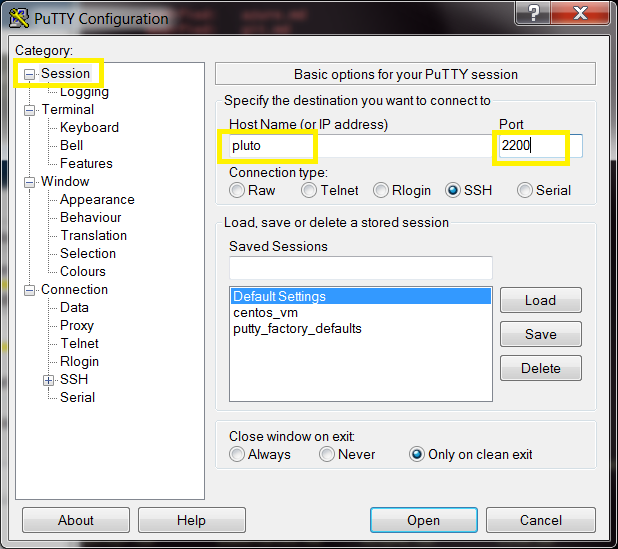
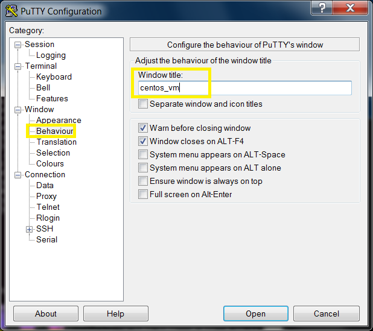
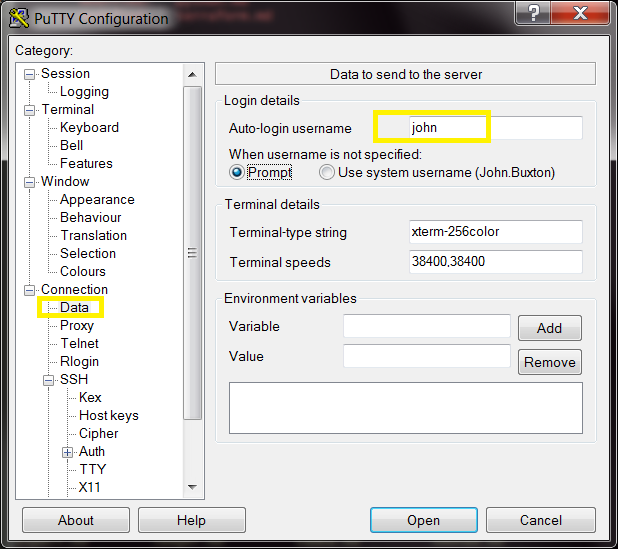
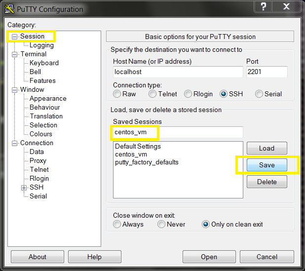

# Creating a new Putty session

1. [Open New Session Dialog](#open-new-session-dialog)
1. [Load an existing session](#load-an-existing-session)
1. [Set host and port](#set-host-and-port)
1. [Set Window Title](#set-window-title)
1. [Check Username](#check-username)
1. [Save as a new session](#save-as-a-new-session)

## Open New Session Dialog

## Load an existing session

Usually you will load the `Default Settings` session as the basis for a new session, but you could clone **any other** existing session if you wish.

## Set host and port

## Set Window Title

Bizarrely, to set the window title, you'll find it under `Behaviour`.
Note: better to skip this step and set the title dynamically from the shell.

## Check Username

## Save as a new session

Type the new session name under `Saved Sessions` then click `Save`.

