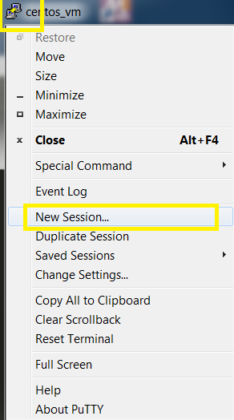

# Creating a new Putty session

1. [Open New Session Dialog](#load-default-settings)
1. [Load an existing session](#load-an-existing-session)
1. [Set host and port](#set-host-and-port)
1. [Set Window Title](#set-Window-Title)
1. [Check Username](#check-Username)
1. [**IMPORTANT** Save the new session](#save-the-new-session)

## Open New Session Dialog

## Load an existing session

Usually you will load the `Default Settings` session as the basis for a new session, but you could clone **any other** existing session if you wish.

## Set host and port

## Set Window Title

Bizarrely, to set the window title, you'll find it under `Behaviour`.

## Check Username

## Save as a new session

Type the new session name under `Saved Sessions` then click `Save`.

