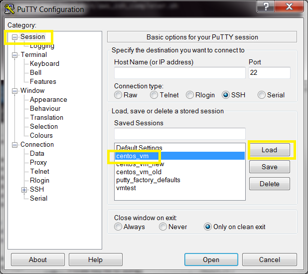
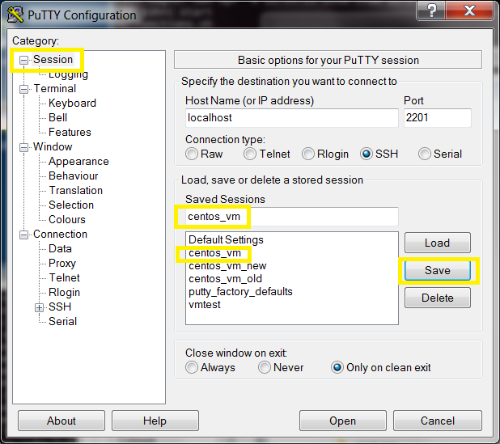

# Modify a session

Unfortunately this is [counter intuitive](#counter-intuitive) in Putty.

## Steps

1. [Open New Session Dialog](#open-new-session-dialog)
1. [Load an existing session](#load-the-session)
1. Make Changes
1. [Save (**IMPORTANT**)](#save-the-session)

### Open New Session Dialog

### Load the session

Load the session you wish to modify:

### Make Changes

### Save the session

Select `Session` then click `Save`.
The session which you loaded should already be selected.

## Counter Intuitive

Changing a session in Putty is counter intuitive:

1. The intuitive approach would be to choose `Change Settings...` from the Putty menu. This unfortunately leads you to a dialog with a restricted set of options and is probably not what you want.
2. Even when you choose the correct option (`New Session...`) it is **very easy** to forget to both load **and** save the correct session.