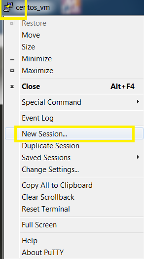
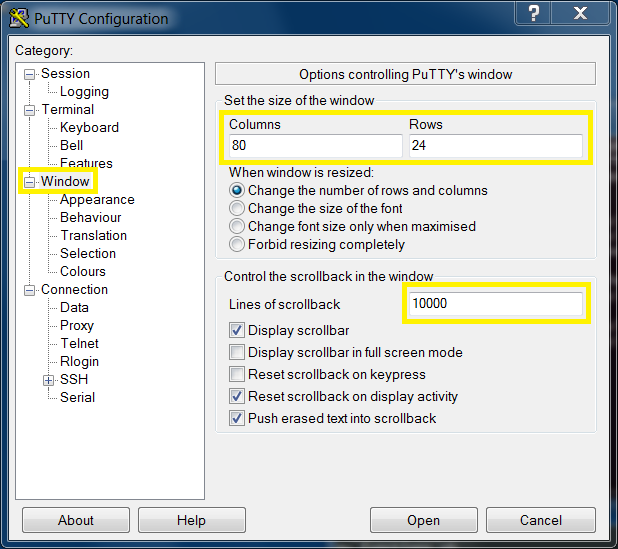

# Setup Session Defaults

These steps configure defaults for the `Default Settings` Putty session.
This session can be used as the basis for creating new sessions.

## Quick Setup

- edit [`default.reg`](Default_Settings.reg), change the first three lines of settings to reflect the correct:
  - log file location
    - typical user name (that you will log in as)
    - private key file (despite the registry name, this *is* the private key not the public)
      - if you don't have a public / private key, create one with [PuTTYgen](https://www.ssh.com/ssh/putty/windows/puttygen)
- Import  [`default.reg`](Default_Settings.reg) into the registry (double-click in explorer)

Tips:

- you can manually edit `default.reg` and re-import it later
- delete lines completely if there are certain settings which you don't want to overwrite
- change the session name to create multiple sets of defaults or to import sets of settings into existing sessions

## Manual Setup

Follow these steps if you prefer the pain and glory of doing this by hand.

### Steps

1. [Open New Session Dialog](#Open-New-Session-Dialog)
1. [Load Default Settings](#Load-Default-Settings)
1. [Logging](#Logging) (smart logfile name)
1. [Window](#Window) (size & scrollback)
1. [Appearance](#Appearance) (font and cursor)
1. [Selection](#Selection) (mouse selection style)
1. [Colours](#Colours)
1. [Data](#Data) (terminal type and user name)
1. [Auth](#Auth) (ssh private key)
1. [X11 Forwarding](#X11-Forwarding)
1. [Save (**IMPORTANT**)](#Save-Defaults)

### Open New Session Dialog

### Load Default Settings

### Logging

- Click `Browse` to set directory.
- Use cookies to set a unique filename for every session, e.g.: `C:\Users\John\Documents\putty_logs\&Y&M&D_&T_&H.log`

### Window

### Appearance

### Selection

### Colours

### Data

### X11 Forwarding

### Save Defaults

